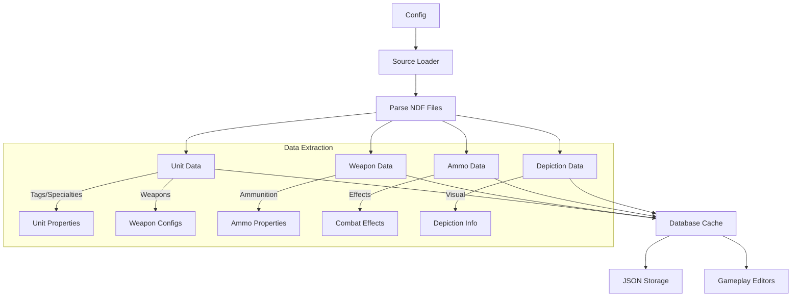

# Project Structure

## Directory Tree
```
warno-actual/
├── assets/               # Root directory for mod assets
├── config/              # Configuration files
│   ├── config.YAML
│   ├── config.template.YAML
│   └── config_loader.py
├── deprecated/          # Legacy code
├── logs/               
└── src/
    ├── common/         # Shared functionality
    │   └── buildings/
    ├── constants/      # Game constants and data
    │   ├── division_edits/
    │   ├── effects/
    │   ├── ui/
    │   ├── unit_edits/
    │   └── weapons/
    │       ├── ammunition/
    │       └── missiles/
    ├── data/           # Data management
    │   ├── database/   # JSON storage
    │   ├── ammo_data.py
    │   ├── depiction_data.py
    │   ├── persistence.py
    │   ├── source_loader.py
    │   └── unit_data.py
    ├── dics/           # Dictionaries
    │   ├── ui/
    │   └── veterancy/
    ├── gameplay/       # Gameplay modifications
    │   ├── buildings/
    │   ├── depictions/
    │   ├── divisions/
    │   ├── division_rules/
    │   ├── effects/
    │   ├── game_constants/
    │   ├── terrains/
    │   ├── ui/
    │   ├── unit_descriptor/
    │   ├── veterancy/
    │   └── weapons/
    ├── ui/             # UI modifications
    │   └── buildings/
    └── utils/          # Utility functions
        ├── asset_utils.py
        ├── config_utils.py
        ├── dictionary_utils.py
        ├── logging_utils.py
        ├── ndf_utils.py
        └── variant_utils.py
```

## Core Files
- `run_patcher.py` - Main entry point
- `src/main.py` - Main patcher logic
- `src/gameplay_mod.py` - Gameplay mod functionality
- `src/ui_mod.py` - UI mod functionality

## Key Components

### Configuration
- Configuration loaded from YAML files
- Template provided for new setups
- Validation of required fields
- Support for development and release targets

Configuration files define:
- Build targets (gameplay/UI/combined)
- Directory paths
- Asset locations
- File variants for different mod types
- Development vs release settings

### Data Management
- Database building and caching
- Unit, weapon, and ammunition data extraction
- Depiction data gathering
- Source file loading
- Data persistence in JSON format

The database system:
1. Extracts data from game files
2. Caches results for performance
3. Provides structured access to:
   - Unit properties
   - Weapon configurations
   - Ammunition data
   - Depiction information



### Asset Management
- Assets copied from `assets/` to `{mod_dir}/GameData/assets/`
- Preserves directory structure
- Excludes readme.md from copying
- Configurable target directory

Asset handling:
1. Source files in `assets/` directory
2. Copied to mod directory preserving structure
3. Supports both UI and gameplay assets
4. Configurable through YAML settings

### Mod Types

1. Gameplay Modifications
   - Unit properties and balance
   - Weapons and ammunition systems
   - Game mechanics
   - Division rules and organization
   - Terrain modifications
   - Combat effects

2. UI Modifications
   - Interface elements
   - Visual assets
   - Text and localization
   - Icons and textures
   - Unit information displays

3. Combined Mods
   - Can use UI mod as base
   - Full gameplay + UI changes
   - Variant handling for different builds

### File Processing
- Source file parsing
- NDF format handling
- Modification application
- Variant processing for different mod types

### Development Features
- Extensive logging system
- Development and release build targets
- Configuration-driven mod building
- Database caching for performance
- Modular design for extensibility
- Error handling and validation
- Debug logging options

### Build Process
1. Configuration Loading
   - Load YAML config
   - Validate required fields
   - Set up build environment

2. Database Building
   - Parse source files
   - Extract required data
   - Build cached database
   - Save to JSON storage

3. Asset Processing
   - Copy from assets directory
   - Maintain structure
   - Handle variants
   - Place in correct mod location

4. Mod Generation
   - Apply modifications
   - Handle file variants
   - Generate output files
   - Create mod structure

5. Output
   - Write to development or release directories
   - Generate logs
   - Verify modifications

## Usage
1. Configure settings in config.YAML
2. Place assets in assets/ directory
3. Run patcher with python run_patcher.py
4. Check logs for results
5. Test mod in game

## Extension Points
- Add new gameplay modifications
- Create UI changes
- Define new file variants
- Add data extraction routines
- Implement new mod features 