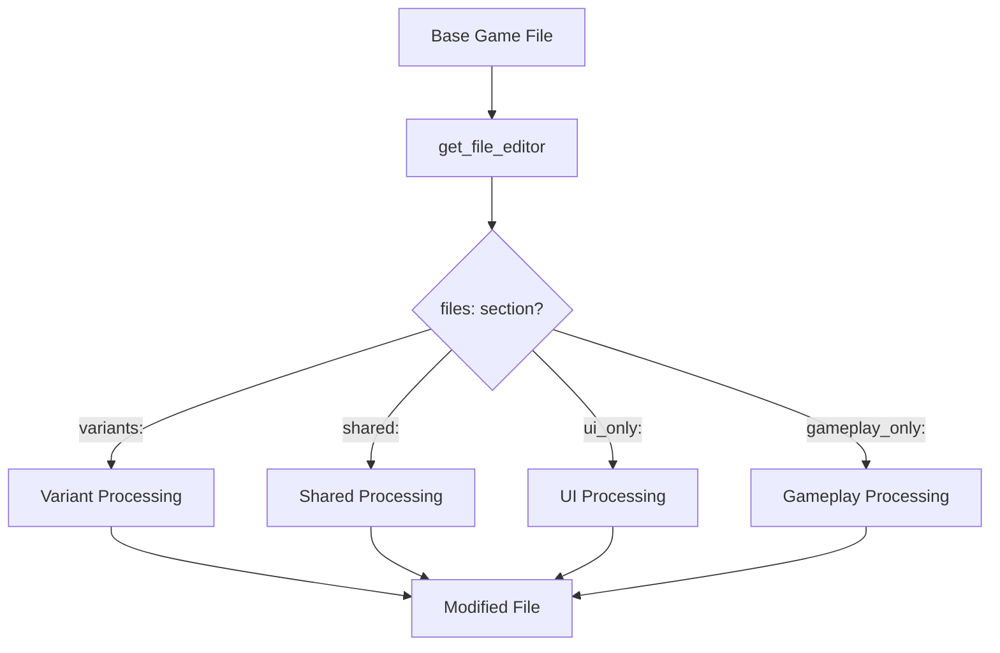
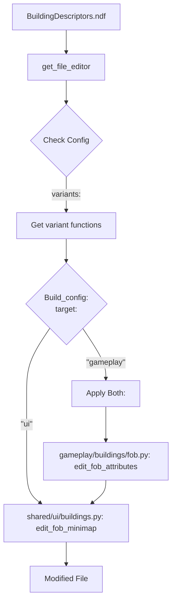
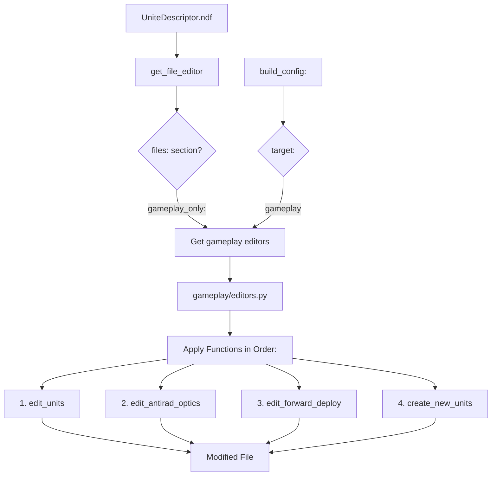
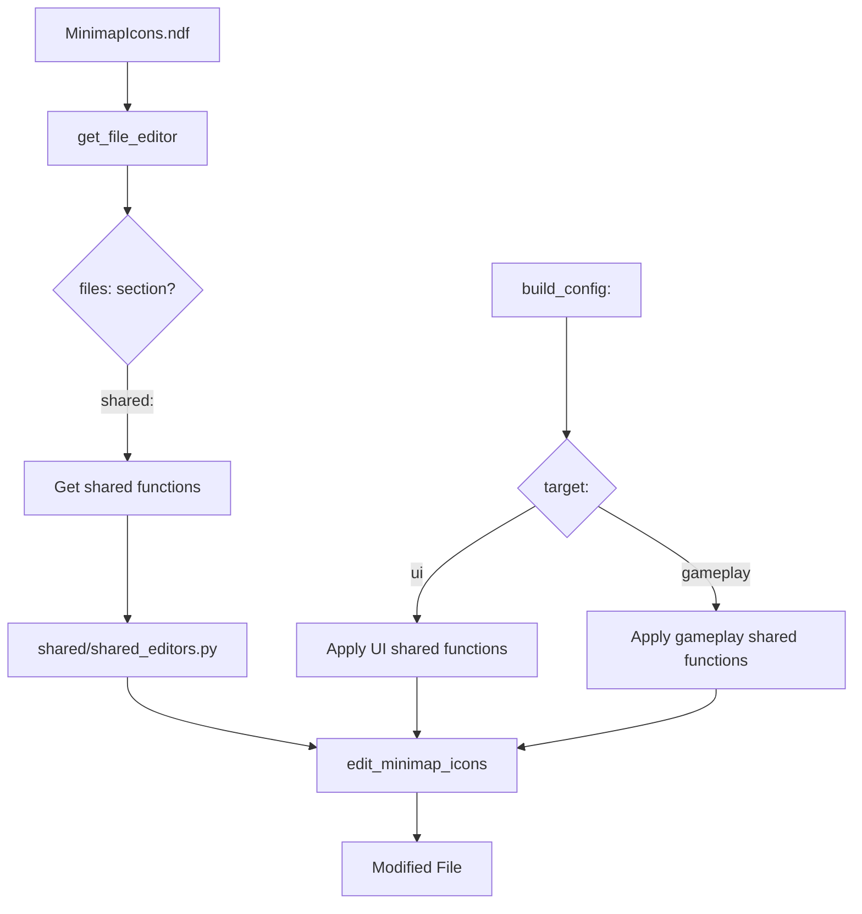
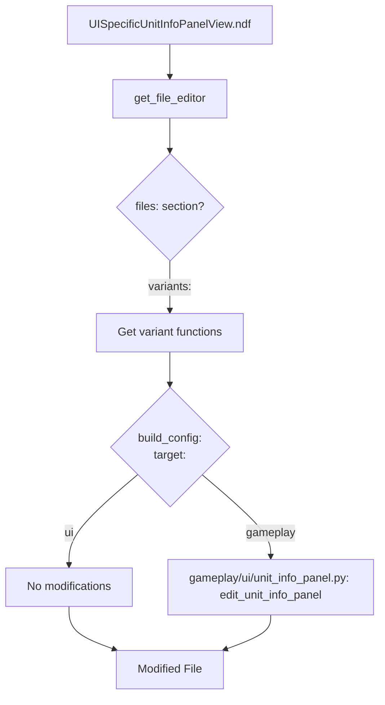

# Configuration Guide

## File Categories

The mod system handles four categories of files:

1. UI-only files
2. Gameplay-only files  
3. Variant files (modified differently between mods)
4. Shared files (modified identically in both mods)

## File Processing Flow

### Basic Flow


### Example: BuildingDescriptors.ndf (Variant File)


### Example: UniteDescriptor.ndf (Gameplay-Only)


### Example: MinimapIcons.ndf (Shared File)


### Example: UISpecificUnitInfoPanelView.ndf (UI File Modified by Gameplay)


## Configuration Examples

### Variant File Example
```yaml
variants:
  "GameData/.../BuildingDescriptors.ndf": {
    "ui": [
      "edit_fob_minimap"  # UI mod only gets minimap function
    ],
    "gameplay": [
      "edit_fob_minimap",    # Gameplay mod gets both functions
      "edit_fob_attributes"  # Additional gameplay-specific changes
    ]
  }
```

### Shared File Example
```yaml
shared:
  "GameData/.../MinimapIcons.ndf": {
    "gameplay": [
      "edit_minimap_icons"
    ],
    "ui": [
      "edit_minimap_icons"  # Same function for both mods
    ]
  }
```

## Function Organization

Functions are organized based on their usage:

```
src/
├── shared/               # Functions used identically by both mods
│   └── ui/
│       └── buildings/
│           └── fob.py   # edit_fob_minimap
│
├── gameplay/            # Functions only used by gameplay mod
│   ├── editors.py      # Main gameplay editors
│   └── ui/             # UI functions specific to gameplay
│       └── unit_info_panel.py
│
└── ui/                 # Functions only used by UI mod
    └── ui/
        └── styles.py
```

## Key Points

1. File Categories:
   - UI-only: Files that only exist in UI mod
   - Gameplay-only: Files that only exist in gameplay mod
   - Variants: Files modified by both mods, but with different functions
   - Shared: Files modified identically in both mods

2. Function Location:
   - Functions live in modules based on their usage
   - Config specifies which functions to apply to each file
   - Order of functions matters within each file

3. Processing Order:
   1. Check if file is variant
   2. Check if file is shared
   3. Check if file has mod-specific editors

4. Editor Types:
   - Variant editors: Different between mods
   - Shared editors: Same in both mods
   - Mod-specific editors: Only exist in one mod

## Common Patterns

1. UI Files Modified by Gameplay:
   ```yaml
   variants:
     "GameData/.../UISpecificUnitInfoPanelView.ndf": {
       "gameplay": ["edit_unit_info_panel"]
     }
   ```

2. Multiple Functions Per File:
   ```yaml
   gameplay_only:
     "GameData/.../UniteDescriptor.ndf": [
       "edit_units",
       "create_new_units"
     ]
   ```

3. Shared UI Components:
   ```yaml
   shared:
     "GameData/.../MinimapIcons.ndf": {
       "gameplay": ["edit_minimap_icons"],
       "ui": ["edit_minimap_icons"]
     }
   ```
