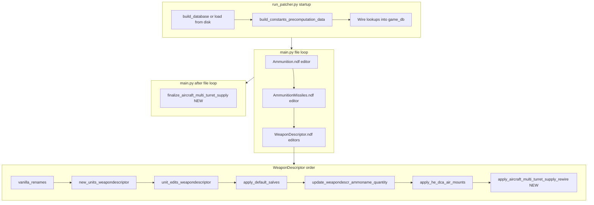

# Aircraft multi-turret supply cost fix (design proposal)

**Status:** Not implemented — deferred design doc for a possible future patcher feature.

**Summary:** Fix undercharged fixed-wing resupply by creating unit-scoped ammo clones (`{base}_for_{unit}`), rewiring mounts in `WeaponDescriptor.ndf`, and cloning descriptors in a conditional post-pass after all NDF editors run.

---

## Problem

WARNO resupplies **all aircraft turrets at once**, but only applies **one turret's `SupplyCost`**. For bombers like `Tu_22_HE_SOV` (18× FAB-500 split across two bomb turrets at 600 supply each), the player pays **600 instead of 1200**.

`SupplyCost` lives on ammo descriptors only (not on `WeaponDescriptor` or `TMountedWeaponDescriptor`), so single-turret planes must keep the shared base ammo unchanged. **Clones are required** — using unit-scoped suffixes (`_for_{unit}`), not loadout-combination encoding.

## Recommended approach: unit-scoped clones (`_for_{unit}`)

For unit `Tu_22_HE_SOV` and mount ammo `Bomb_FAB_500kg_salvolength9`:

```
Bomb_FAB_500kg_salvolength9_for_Tu_22_HE_SOV  →  SupplyCost 1200
```

Both bomb turrets point at the same clone. Mixed-load planes get one clone per distinct qualifying ammo on that unit (e.g. Sparrow and Sidewinder each get `_for_{unit}`); different units never share a variant namespace.

See **Naming / SupplyCost rules** at end of Processing section below.

---

## Processing pipeline and efficiency

### Where this runs in the patcher



**Key constraint:** [`Ammunition.ndf` is edited before `WeaponDescriptor.ndf`](../src/editors.py). Clone **creation** must happen in a **finalize pass** after the weapon descriptor rewire, so clones inherit fully patched base descriptors (standards + constants edits already applied in pass 1).

---

### What precomputation IS used for (cheap lookups)

Add `build_aircraft_multi_turret_lookups(game_db)` in [`constants_precomputation.py`](../src/data/constants_precomputation.py), called from `build_constants_precomputation_data` (runs **every patch**, like `he_dca_weapons` and `deployment_time_units`). Wire into `game_db` in [`run_patcher.py`](../run_patcher.py):

```python
ammo_db_precomp["aircraft_multi_turret_lookups"] = constants_data.get(
    "aircraft_multi_turret_lookups", {},
)
```

**Precomputed maps (built once per patch run, O(constants + ammo_properties + unit_data)):**

| Map | Source | Used for |
|-----|--------|----------|
| `fixed_wing_units: set[str]` | `unit_data[*].airplane_movement` + `NEW_UNITS` donors | Skip non-aircraft weapon descriptors immediately |
| `new_unit_aircraft: dict[str, str]` | `NEW_UNITS` where donor has `airplane_movement` | Map `NewName → donor` when new unit not yet in `unit_data` |
| `supply_cost_by_base: dict[str, float]` | Merged `ammunitions` + `missiles` constants (`SupplyCost` / `parent_membr.SupplyCost`), overridden by constants | Resolve per-mount cost without scanning constants dict per mount |
| `excluded_ammo_bases: set[str]` | Categories `autocannon`, `small_arms` + name-prefix rules | Skip MG/cannon mounts cheaply |
| `missile_ammo_bases: set[str]` | Keys in `missiles` constants (+ vanilla missile `ammo_properties`) | Route clone to `AmmunitionMissiles.ndf` vs `Ammunition.ndf` |

Optionally persist to `constants_precomputation/aircraft_multi_turret_lookups.json` (same pattern as `he_dca_weapons.json`) for debugging; **runtime source of truth is `game_db` in memory**.

**Optional validation only (log warnings, do not drive rewire):** scan vanilla `game_db["weapons"]` + `unit_edits` `equipmentchanges.replace` map (same partial simulation as [`build_deployment_time_units`](../src/data/constants_precomputation.py)) to estimate candidate fixed-wing units. Useful for CI/logging; **not authoritative** because inserts/replacements aren't fully simulated.

---

### What precomputation is NOT used for (must scan live NDF)

**Do not** build the clone list or rewire targets from `game_db["weapons"]` alone:

| Reason | Detail |
|--------|--------|
| Stale layout | `game_db["weapons"]` is built from **vanilla** `WeaponDescriptor.ndf` at database build time ([`gather_weapon_data`](../src/data/unit_data.py)) |
| `unit_edits` | [`unit_edits_weapondescriptor`](../src/gameplay_mods/generated/gameplay/gfx/weapon_descriptor/handlers/unit_edits.py) applies `equipmentchanges.replace/insert`, turret edits, etc. **at patch time** — not reflected in `weapon_db` |
| `NEW_UNITS` | [`new_units_weapondescriptor`](../src/gameplay_mods/generated/gameplay/gfx/weapon_descriptor/handlers/new_units.py) creates `WeaponDescriptor_{NewName}` and may insert/replace turrets before unit edits run |
| `insert_turret_templates` | Precomputed templates ([`build_insert_turret_templates`](../src/data/insert_turret_templates.py)) help **apply** inserts; they don't update `weapon_db` |
| Prior patcher passes | `apply_default_salves`, `update_weapondescr_ammoname_quantity`, and `apply_he_dca_air_mounts` change live mount ammo paths before our pass |

**Authoritative input:** one linear scan of **`WeaponDescriptor.ndf` in memory** at the end of the weapon descriptor editor, after all steps above. Same pattern as the HAGRU post-pass in `unit_edits.py` (lines 109–197), which also requires live descriptors.

---

### Integration with unit_edits, NEW_UNITS, and ammo dictionaries

**Unit edits**

- No changes required in [`unit_edits/`](../src/constants/unit_edits/) for affected vanilla planes (e.g. Tu-22).
- Units with `WeaponDescriptor.equipmentchanges.insert` (e.g. [`F111F_Aardvark_CBU_US`](../src/constants/unit_edits/USA_unit_edits.py)) are handled automatically because the scan sees **post-edit** turret count and ammo paths.
- Do **not** duplicate `unit_edits` logic in precomputation — only read live NDF.

**NEW_UNITS**

- `new_units_weapondescriptor` runs **before** `unit_edits_weapondescriptor`; our pass runs **after both**, so it sees final layout for new fixed-wing units.
- Fixed-wing gate: `unit_name in fixed_wing_units` OR `unit_name in new_unit_aircraft` (donor had `airplane_movement`).
- Clone suffix uses **`NewName`**, not donor name (`WeaponDescriptor_{NewName}` → `_for_{NewName}`).

**Ammo dictionaries (`game_db["ammunition"]`)**

- **Renames:** merged `renames_old_new` / `renames_new_old` ([`run_patcher.py`](../run_patcher.py)) — mounts should already use post-rename names when our pass runs (weapon + ammo vanilla renames happen earlier). Supply lookup uses **mount path as-is**; base-name stripping for cost lookup does not apply rename reverse-mapping unless a mount still carries an old name (log warning + try `renames_old_new`).
- **Constants dicts:** precomputed `supply_cost_by_base` replaces per-mount iteration over `ammunitions.items()` / `missiles.items()`.
- **No new constants entries:** `_for_{unit}` clones are **not** added to `raw_ammunitions` / `raw_missiles` — they bypass the main [`edit_gen_gp_gfx_ammunition`](../src/gameplay_mods/generated/gameplay/gfx/ammunition_/ammunition.py) per-weapon loop entirely (same as `_AIR` clones). No impact on standards ordering or `ammunitions.json` export count.

---

### Efficient rewire pass (WeaponDescriptor editor)

**Algorithm — single O(descriptors × turrets × mounts) scan:**

1. Initialize `clone_specs: dict[str, CloneSpec] = {}` on `game_db["ammunition"]`.
2. For each `WeaponDescriptor_*` in `source_path`:
   - Derive `unit_name`; **continue** if not fixed-wing (precomputed set).
   - Walk turrets; collect qualifying turret slots (non-excluded ammo).
   - **Continue** if `< 2` qualifying turrets (majority of units exit here).
   - Compute `total_supply` and per-ammo costs using precomputed maps.
   - For each distinct mount ammo `B` needing a variant: `V = f"{B}_for_{unit_name}"`.
   - Rewire mount paths; **`clone_specs[V] = {base: B, cost, ndf_file, unit_name}`** (dict dedupe — Tu-22 adds one entry, not two).
3. Log summary: `{N} units rewired, {M} unique clones scheduled`.

**Placement:** last step in [`weapondescriptor.py`](../src/gameplay_mods/generated/gameplay/gfx/weapon_descriptor/weapondescriptor.py), after `apply_he_dca_air_mounts`.

**Idempotency:** skip mounts already pointing at `_for_{unit_name}`; skip clone if variant namespace already exists in ammo NDF at finalize time.

---

### Efficient finalize pass (main.py)

**Conditional execution — avoid opening ammo files when unnecessary:**

```python
specs = game_db.get("ammunition", {}).get("aircraft_multi_turret_clones", {})
if not specs:
    return  # no fixed-wing multi-turret units affected
```

Then:

1. Open only `Ammunition.ndf` and/or `AmmunitionMissiles.ndf` if at least one spec targets that file.
2. For each spec: `base = source.by_n(f"Ammo_{base_ns}")`; if missing, log error and skip; if `Ammo_{variant_ns}` exists, skip (idempotent).
3. `copy()` base descriptor → set GUID, namespace, `SupplyCost` only (mirror [`he_dca_air_clones.py`](../src/gameplay_mods/generated/gameplay/gfx/ammunition_/handlers/he_dca_air_clones.py)).
4. **No second weapon descriptor pass** — rewire already done; finalize only materializes ammo rows.

**Cost bounds:** clone count ≤ `(fixed-wing units with ≥2 qualifying turrets) × (distinct qualifying ammo per unit)` — typically single digits to low tens per patch, not combinatorial.

---

### Naming and SupplyCost rules (reference)

**Suffix:** `{live_mount_ammo}_for_{unit_name}` — strip `_for_*` only for category/cost base lookup.

| Loadout | Clone(s) | SupplyCost |
|---------|----------|------------|
| Uniform (Tu-22) | one `_for_{unit}` per base ammo | `base × qualifying_turret_count` |
| Mixed | one `_for_{unit}` per distinct qualifying ammo | primary = **sum**; others = **0** |

**Excluded ammo:** `autocannon`, `small_arms`, `AutoCanon_` / `MG_` / `MMG_` / `HMG_` prefixes.

**Scope:** fixed-wing only; resupply cost target = sum of qualifying turret base costs (excluding MG/cannon).

---

## Implementation checklist

When implementing, suggested task order:

1. **Precompute lookups** — `build_aircraft_multi_turret_lookups` in `constants_precomputation.py`; wire into `game_db` in `run_patcher.py`
2. **Shared logic** — `aircraft_multi_turret_supply.py` with detection, cost resolution, rewire + clone helpers
3. **Weapon rewire** — final step in `weapondescriptor.py`; accumulate deduped clone specs in `game_db`
4. **Finalize pass** — conditional `finalize_aircraft_multi_turret_supply()` in `main.py`
5. **Tests** — `testing/test_aircraft_multi_turret_supply.py` (Tu-22, mixed-ammo unit, NEW_UNITS donor fallback, MG exclusion, idempotency)

## Implementation files

| File | Role |
|------|------|
| [`src/data/constants_precomputation.py`](../src/data/constants_precomputation.py) | `build_aircraft_multi_turret_lookups`, optional JSON save |
| [`run_patcher.py`](../run_patcher.py) | Wire lookups into `game_db` |
| [`src/gameplay_mods/.../handlers/aircraft_multi_turret_supply.py`](../src/gameplay_mods/generated/gameplay/gfx/ammunition_/handlers/) | Shared logic + clone application (new file) |
| [`src/gameplay_mods/.../weapondescriptor.py`](../src/gameplay_mods/generated/gameplay/gfx/weapon_descriptor/weapondescriptor.py) | Rewire pass |
| [`src/main.py`](../src/main.py) | Conditional finalize pass |

---

## Alternatives considered (brief)

- **`_mt{N}` uniform-only** — simpler but misses mixed missile loads.
- **Manual constants** — no automation.
- **`_ac_{loadout_key}`** — rejected (suffix complexity / collision risk with `_HAGRU`, `_AIR`, etc.).

---

## Tests

Add [`testing/test_aircraft_multi_turret_supply.py`](../testing/test_aircraft_multi_turret_supply.py):

- Lookup builder: fixed-wing set includes vanilla aircraft; NEW_UNITS donor fallback
- Tu-22 plan from mock descriptor → one deduped clone spec at 1200
- Mixed loadout → primary/secondary costs
- MG exclusion; idempotent rewire + clone skip
- `finalize` skips when `clone_specs` empty

Run: `.\.venv\Scripts\python.exe -m unittest testing.test_aircraft_multi_turret_supply -v`.

## No constants dict changes

Runtime clones only; do not hand-author `_for_{unit}` entries in `bomb.py` / `a2a.py`.
